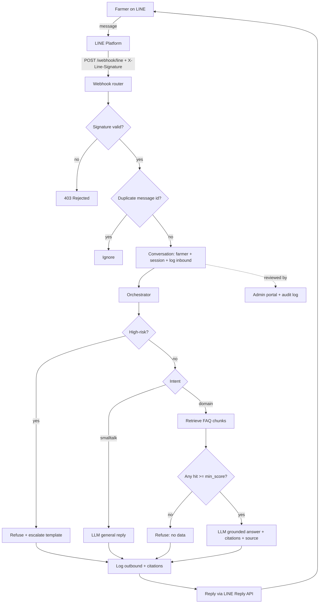
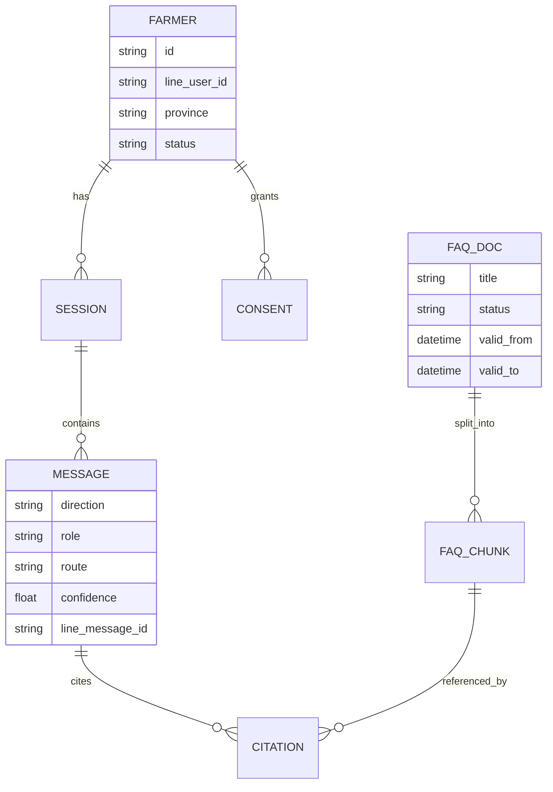

# How It Works — Thai Farmer LINE LLM Agent

A detailed, code-accurate guide to the system: what each part does, how a message
flows end to end, how the **LINE interface** works, and how it's deployed.

- **Live service:** https://thai-farmer-agent.onrender.com
- **Admin portal:** https://thai-farmer-agent.onrender.com/admin (password sign-in)
- **Stack:** FastAPI · SQLAlchemy · Jinja2 · httpx · Claude (Anthropic) · Render + PostgreSQL

---

## 1. What the system is

A guardrailed assistant that Thai farmers chat with over **LINE**. It answers general
small talk conversationally, but answers **agriculture questions only from a curated,
expert-reviewed knowledge base (RAG) with citations** — and **refuses high-risk topics**
(pesticide dosage, medical, legal, financial). Every interaction is logged and auditable.

The core safety promise: **the model never invents agricultural facts.** If there's no
grounded source above a confidence threshold, the agent refuses instead of guessing.

---

## 2. High-level architecture



---

## 3. Inbound message lifecycle (step by step)

Entry points live in [app/routers/webhook.py](webhook.py). Both the real LINE webhook and
the local simulator share the same `_process()` pipeline:

1. **Deduplication** — `conversation.is_duplicate()` checks `message.line_message_id`.
   LINE can retry webhook deliveries, so repeated IDs are ignored (idempotency).
2. **Farmer resolution** — `get_or_create_farmer()` finds/creates a `Farmer` keyed by the
   pseudonymous `line_user_id`. On first contact it also records a baseline PDPA `Consent`.
3. **Session resolution** — `get_active_session()` reuses the farmer's latest session if it
   was active within 30 minutes (`SESSION_IDLE_SECONDS`), else starts a new one.
4. **Log inbound** — the user message is stored (`direction=inbound`, `role=user`).
5. **Orchestrate** — `orchestrator.handle()` decides the route and produces the reply.
6. **Log outbound** — the agent reply is stored with `intent`, `route`, `model`,
   `confidence`, `latency_ms`, and any `Citation` rows.
7. **Reply** — `line_client.reply()` sends the text back to the user via LINE.

---

## 4. The orchestrator (decision logic)

[app/orchestrator.py](app/orchestrator.py) enforces the anti-misinformation policy,
independent of which LLM is configured. Order matters:

1. **Safety gate first** — `guardrails.is_high_risk(text)` → if true, return the fixed
   `HIGH_RISK_RESPONSE_TH` template with `route="refused"`. The model is never called.
2. **Intent classification** — `guardrails.classify_intent(text)` returns `domain` or
   `smalltalk` based on keyword lists.
3. **Small talk** — the LLM answers conversationally with no grounding required
   (`route="smalltalk"`).
4. **Domain question** — retrieve FAQ chunks:
   - **No hits** above `RETRIEVAL_MIN_SCORE` → return `NO_ANSWER_RESPONSE_TH`
     (`route="refused"`, confidence 0). *No hallucination.*
   - **Hits** → the LLM writes an answer **from the retrieved chunks only**, citations are
     attached, and a human-readable **`แหล่งข้อมูล:` (Sources:)** line is appended
     (`route="faq_grounded"`).

`AgentResult` carries `reply, intent, route, model, confidence, latency_ms, citations`.

---

## 5. Guardrails

[app/guardrails.py](app/guardrails.py) is deliberately simple and **table-driven** so it's
auditable:

- `HIGH_RISK_KEYWORDS` — pesticide/chemical dosage, medical, legal, financial terms (Thai +
  English). Any match → hard refuse + escalate.
- `DOMAIN_KEYWORDS` — agriculture signals (rice, soil, fertilizer, pests, etc.) → route to RAG.
- Fixed Thai response templates for refusals so wording is consistent and safe.

> In production these lists should be maintained by domain experts and optionally backed by a
> classifier — but the *policy* stays enforced in the orchestrator regardless of model output.

---

## 6. Retrieval (RAG)

[app/retrieval.py](app/retrieval.py) + [app/embeddings.py](app/embeddings.py):

- The query is embedded, then compared by **cosine similarity** against every **published**
  FAQ chunk that is currently valid (`valid_from`/`valid_to` window).
- Returns the top `RETRIEVAL_TOP_K` (default 4) chunks scoring ≥ `RETRIEVAL_MIN_SCORE`
  (default 0.18).
- **Embedders:**
  - `hashing` (default) — offline, dependency-free, uses character trigrams so it handles
    space-less Thai. Good for demos; can produce false-positive matches.
  - `openai` — real embedding model (set `EMBEDDINGS_PROVIDER=openai` + key) for production
    quality. *(Anthropic has no embeddings endpoint.)*
- Cosine similarity is computed in Python so it runs on SQLite. On PostgreSQL you can migrate
  `faq_chunk.embedding` to **pgvector** and use indexed nearest-neighbour search.

---

## 7. LLM providers

[app/llm.py](app/llm.py) exposes a narrow `generate(user_text, context_chunks)` contract with
three implementations, chosen by `get_llm()`:

- **`stub`** — offline extractive responder (no keys); used for local dev/tests.
- **`anthropic`** — Claude via the Messages API (this deployment). Requires an Anthropic
  **API key with credits** (not a claude.ai subscription).
- **`openai`** — any OpenAI-compatible chat endpoint.

For domain questions the prompt says *"answer only from the provided reference data"*, and the
system prompt (`SYSTEM_PROMPT_TH`) instructs polite Thai and no fabrication. The orchestrator's
grounding/citation rules are the real safeguard — the provider is swappable.

---

## 8. Data model

[app/models.py](app/models.py) — UUID string PKs (portable across SQLite/Postgres),
embeddings stored as JSON arrays.



- **Farmer** — pseudonymous, keyed by `line_user_id` (no phone/national ID).
- **Consent** — purpose-based, versioned (PDPA).
- **Session** — 30-minute idle window; groups messages.
- **Message** — inbound/outbound with routing + telemetry + `line_message_id` for dedupe.
- **FaqDoc / FaqChunk** — knowledge base; only `status=published` and in-date is retrievable.
- **Citation** — links an answer to the exact chunk(s) it used, with score.
- **AuditEvent** — append-only log of admin actions (e.g. viewing conversations).

---

## 9. How the LINE interface works

This is the integration that connects farmers' LINE chats to the app. Two files:
[app/routers/webhook.py](app/routers/webhook.py) and [app/line_client.py](app/line_client.py).

### 9.1 Concepts
LINE's **Messaging API** works over webhooks, not polling:
- Each bot is a **LINE Official Account** with a **Messaging API channel** in the
  [LINE Developers Console](https://developers.line.biz/).
- You configure a **Webhook URL**. When a user messages the account, LINE sends an HTTPS
  **POST** to that URL with a JSON payload of **events**.
- You reply using a short-lived **`replyToken`** from the event (valid ~30s, one use).

### 9.2 Inbound: receiving a message
`POST /webhook/line` does:
1. Read the **raw request body** (bytes) — needed for signature verification.
2. **Verify `X-Line-Signature`** via `line_client.verify_signature()`:
   - Compute `HMAC-SHA256(body, LINE_CHANNEL_SECRET)`, base64-encode it, and compare with the
     header using a constant-time check. Mismatch → **HTTP 403**.
   - If no channel secret is configured (local dev), verification is **skipped** so testing
     works without credentials.
3. Parse the JSON and iterate `events`. It only handles `type == "message"` with
   `message.type == "text"`. For each it extracts:
   - `source.userId` → `line_user_id`
   - `message.text` → the question
   - `message.id` → `line_message_id` (dedupe)
   - `replyToken` → used to answer
4. Run `_process(...)` (the pipeline in §3) and, if not a duplicate, reply.
5. Return `{"status":"ok","handled":N}` (LINE expects a fast 200).

### 9.3 Outbound: replying
`line_client.reply(reply_token, text)` calls the **Reply API**:
```
POST https://api.line.me/v2/bot/message/reply
Authorization: Bearer <LINE_CHANNEL_ACCESS_TOKEN>
{ "replyToken": "...", "messages": [ { "type": "text", "text": "..." } ] }
```
- Text is truncated to 4900 chars (LINE's limit is 5000).
- If no access token/reply token is configured, it's a no-op (safe for local dev).

### 9.4 Signature verification (why it matters)
`X-Line-Signature` proves the request genuinely came from LINE and wasn't tampered with. This
prevents anyone from POSTing fake messages to your webhook. Combined with `line_message_id`
dedupe, the endpoint is safe against replays and retries.

### 9.5 Setting it up in the LINE console
1. Create a **Provider** → a **Messaging API channel**.
2. Copy the **Channel secret** → env `LINE_CHANNEL_SECRET`.
3. Issue a **Channel access token** (long-lived) → env `LINE_CHANNEL_ACCESS_TOKEN`.
4. Set the **Webhook URL** to:
   `https://thai-farmer-agent.onrender.com/webhook/line`
5. **Enable "Use webhook"**, and disable auto-reply/greeting messages so the bot controls replies.
6. Add the bot as a friend (QR code) and message it to test.

### 9.6 Testing without LINE
Use the simulator — same pipeline, no credentials:
```bash
curl -X POST https://thai-farmer-agent.onrender.com/webhook/simulate \
  -H "Content-Type: application/json" \
  -d '{"line_user_id":"U_demo","text":"ข้าวใบเหลืองควรทำอย่างไร"}'
```
The JSON response shows `reply`, `route`, `confidence`, `model`, and `citations`.

---

## 10. Admin portal

[app/routers/admin.py](app/routers/admin.py) — served at `/admin`:
- **Password sign-in** (`/admin/login`, default password `6969`, override with `ADMIN_PASSWORD`).
  On success it sets an HttpOnly session cookie; unauthenticated hits redirect to the login page.
  An `X-Admin-Token`/`?token=` fallback remains for API clients.
- **`/admin/conversations`** — recent sessions with per-message tags (grounded/refused/etc.)
  and citation counts.
- **`/admin/faq`** — list and create FAQ entries (new entries are chunked + embedded immediately).
- **`/admin/api/messages`** — JSON export of logged messages.
- Every view of conversation content writes an **`AuditEvent`** (PDPA accountability).

---

## 11. Configuration

[app/config.py](app/config.py) loads a local `.env` (never overriding real env vars) into a
frozen `Settings` object. Key variables (see [.env.example](.env.example)):

| Variable | Purpose | Default |
|---|---|---|
| `DATABASE_URL` | DB connection (`postgres://` auto-normalized to psycopg) | SQLite file |
| `LLM_PROVIDER` | `stub` \| `anthropic` \| `openai` | `stub` |
| `ANTHROPIC_API_KEY` / `ANTHROPIC_MODEL` | Claude access | — / `claude-3-5-sonnet-latest` |
| `EMBEDDINGS_PROVIDER` | `hashing` \| `openai` | `hashing` |
| `RETRIEVAL_TOP_K` / `RETRIEVAL_MIN_SCORE` | RAG tuning | 4 / 0.18 |
| `LINE_CHANNEL_SECRET` / `LINE_CHANNEL_ACCESS_TOKEN` | LINE integration | — |
| `ADMIN_PASSWORD` / `ADMIN_TOKEN` | Admin auth | `6969` / generated |

---

## 12. Startup & seeding

[app/main.py](app/main.py) uses a FastAPI lifespan hook to `init_db()` (create tables) and
`seed_if_empty()` on boot. On an empty DB, [app/seed.py](app/seed.py) inserts sample Thai FAQs
(rice yellowing, acidic soil, brown planthopper, harvest timing, cassava care), chunks and
embeds them. `/health` reports status and the active providers; `/` redirects to `/docs`.

> Sample FAQ content is **illustrative only** — production content must be authored/reviewed by
> domain experts and attributed to authoritative sources (Department of Agriculture / Rice Dept).

---

## 13. Deployment (Render)

[render.yaml](render.yaml) is a Blueprint that provisions a **web service + managed PostgreSQL**
(Singapore region):
- `buildCommand: pip install -r requirements.txt`
- `startCommand: uvicorn app.main:app --host 0.0.0.0 --port $PORT`
- `DATABASE_URL` is auto-injected from the database; `ADMIN_TOKEN` is auto-generated.
- Secrets set in the dashboard: `ANTHROPIC_API_KEY`, `LINE_CHANNEL_SECRET`,
  `LINE_CHANNEL_ACCESS_TOKEN`.
- Postgres (not SQLite) is used in prod so data survives Render's ephemeral disk.

**Note on auto-deploy:** if the GitHub auto-deploy hook isn't connected, trigger a deploy of the
latest commit with the Render CLI:
```
render deploys create <service-id>
```

---

## 14. Local development

```bash
python -m venv .venv && .venv\Scripts\activate      # Windows
pip install -r requirements.txt
uvicorn app.main:app --reload
python -m tests.smoke_test                          # must print SMOKE TEST PASSED
```
Defaults (SQLite + hashing embedder + stub LLM) require **no keys**.

---

## 15. Security & privacy summary

- Pseudonymous `line_user_id` only; no phone/national ID.
- Webhook verifies `X-Line-Signature` (HMAC-SHA256) + idempotency dedupe.
- Consent is purpose-based/versioned; admin views are audited (append-only).
- If using an external LLM, redact PII before egress and keep a DPA; prefer in-region hosting.
