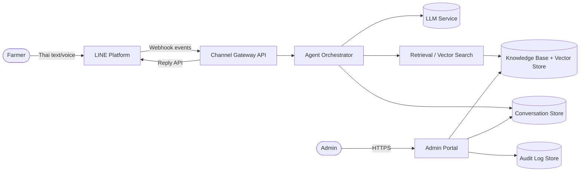
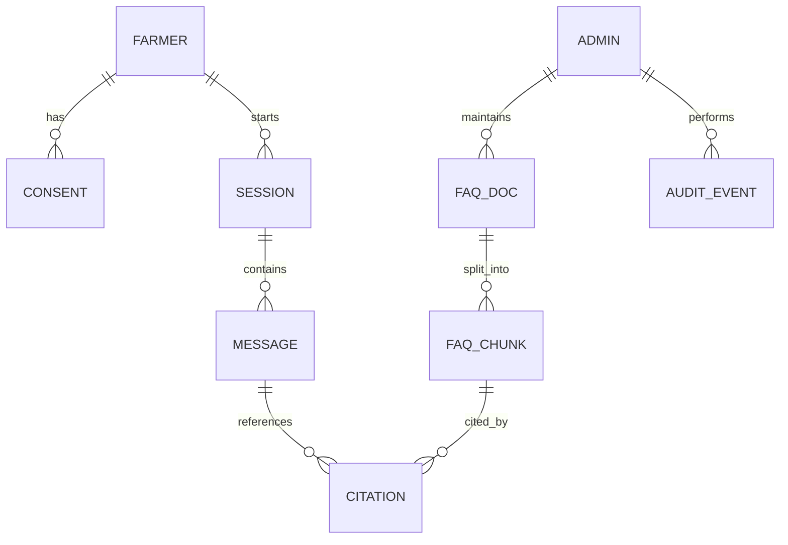
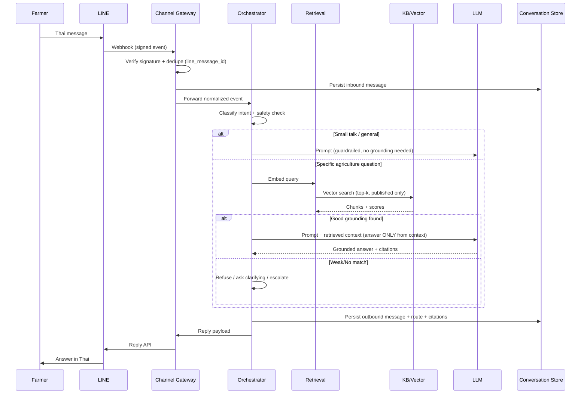
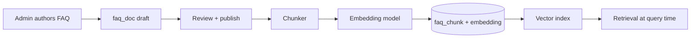

# Data Architecture Document
## Thai Farmer LINE LLM Advisory Agent

| Field | Value |
|---|---|
| Document type | Engineering Data Architecture |
| Version | 0.1 (Draft) |
| Status | For review |
| Last updated | 2026-07-16 |
| Owner | Platform Engineering |

---

## 1. Purpose & Scope

This document defines the **data architecture** for an LLM advisory agent that serves
Thai farmers through the **LINE messaging app**. It covers data entities, stores,
flows, retention, governance and the integration boundaries between the LINE channel,
the LLM/RAG layer, the knowledge base, and the admin portal.

**In scope**
- Conversational data (inbound/outbound messages, sessions).
- Knowledge base / FAQ content and its vector representations.
- User (farmer) profile and consent data.
- Admin portal read/audit data.
- Data governance, retention and PDPA (Thailand) compliance.

**Out of scope**
- Model training/fine-tuning pipeline internals (referenced only).
- Infrastructure/network topology (separate infra doc).
- Billing/commercial integrations.

---

## 2. Business Context

Farmers in Thailand interact in Thai language with an LLM agent over LINE. The agent:

1. Answers **simple/general questions** conversationally.
2. Actively **prevents misinformation / misunderstanding** by grounding answers and
   refusing to speculate on high-risk topics (pesticide dosage, regulations, finance).
3. For **specific agriculture questions**, retrieves from a **curated FAQ / knowledge
   base** and answers *only* from that grounded content (retrieval-augmented generation).
4. Logs all interactions so an **admin** can review them via an admin portal.

**Key data-driven requirements**
- Every answer to a domain question must be **traceable to a source FAQ entry** (citation).
- Interactions must be **auditable** and **searchable** by admins.
- Personal data must be handled per **PDPA (Thailand, B.E. 2562 / 2019)**.

---

## 3. System Context (C4 Level 1)

---

## 4. Logical Data Architecture

### 4.1 Data domains

| Domain | Description | Primary store |
|---|---|---|
| Identity & Consent | Farmer identity (LINE userId), consent state | Relational DB |
| Conversation | Sessions, messages, agent decisions, citations | Relational DB + object store |
| Knowledge | FAQ documents, chunks, embeddings, categories | Relational DB + Vector store |
| Analytics | Aggregated metrics, intent stats | Analytics/warehouse |
| Audit & Compliance | Immutable access + admin action logs | Append-only log store |

### 4.2 Store selection rationale

| Store | Technology (recommended) | Why |
|---|---|---|
| Relational DB | PostgreSQL | Strong consistency, JSONB for flexible message metadata, mature ecosystem |
| Vector store | pgvector (Postgres extension) or Qdrant/Milvus | Semantic FAQ retrieval; pgvector keeps ops simple at small/medium scale |
| Object store | S3-compatible (e.g. MinIO/S3) | Raw payloads, media/voice attachments, exports |
| Cache / session | Redis | Short-lived conversation context, rate limiting, idempotency keys |
| Audit log | Append-only table + WORM object store | Tamper-evident compliance trail |
| Analytics | Warehouse (BigQuery/ClickHouse) | Aggregations without loading OLTP DB |

> Start with **PostgreSQL + pgvector + Redis + S3**. Split out a dedicated vector DB
> and warehouse only when volume/latency requires it.

---

## 5. Core Data Entities & Schemas

### 5.1 Entity Relationship Overview

### 5.2 `farmer`

| Column | Type | Notes |
|---|---|---|
| id | UUID (PK) | Internal id |
| line_user_id | TEXT (unique) | LINE-scoped user id; **pseudonymous**, not a phone number |
| display_name | TEXT (nullable) | Only if user permits |
| province | TEXT (nullable) | Coarse location for agronomic context |
| preferred_lang | TEXT | Default `th` |
| created_at | TIMESTAMPTZ | |
| status | ENUM(active, blocked, deleted) | Soft-delete support |

> Do **not** store LINE access tokens against a farmer. Never store raw national ID or
> phone number unless a separate explicit consent + purpose is defined.

### 5.3 `consent`

| Column | Type | Notes |
|---|---|---|
| id | UUID (PK) | |
| farmer_id | UUID (FK) | |
| purpose | ENUM(service, analytics, contact) | Purpose-based consent (PDPA) |
| granted | BOOLEAN | |
| version | TEXT | Consent text version |
| granted_at / revoked_at | TIMESTAMPTZ | |

### 5.4 `session`

| Column | Type | Notes |
|---|---|---|
| id | UUID (PK) | |
| farmer_id | UUID (FK) | |
| channel | ENUM(line) | Extensible for future channels |
| started_at / last_activity_at | TIMESTAMPTZ | |
| context_summary | TEXT | Rolling summary for long conversations |
| state | JSONB | Slot-filling / conversation state |

### 5.5 `message`

| Column | Type | Notes |
|---|---|---|
| id | UUID (PK) | |
| session_id | UUID (FK) | |
| direction | ENUM(inbound, outbound) | |
| role | ENUM(user, agent, system) | |
| content | TEXT | Message text |
| content_type | ENUM(text, image, audio, sticker) | |
| media_ref | TEXT (nullable) | Object-store key |
| intent | TEXT (nullable) | Classified intent |
| route | ENUM(smalltalk, faq_grounded, refused, escalated) | Decision taken by orchestrator |
| model | TEXT (nullable) | Model + version used |
| tokens_in / tokens_out | INT | Cost/observability |
| confidence | NUMERIC (nullable) | Retrieval/answer confidence |
| latency_ms | INT | |
| created_at | TIMESTAMPTZ | |
| line_message_id | TEXT | Idempotency / dedupe |

### 5.6 `faq_doc` (source of truth for grounding)

| Column | Type | Notes |
|---|---|---|
| id | UUID (PK) | |
| title | TEXT | |
| category | TEXT | e.g. rice, soil, pests, subsidies |
| body_th | TEXT | Canonical Thai content |
| source | TEXT | Authoritative source (e.g. DOA, RD) |
| status | ENUM(draft, published, archived) | Only `published` is retrievable |
| version | INT | |
| valid_from / valid_to | DATE (nullable) | Seasonal/regulatory validity |
| updated_by | UUID (FK admin) | |
| updated_at | TIMESTAMPTZ | |

### 5.7 `faq_chunk`

| Column | Type | Notes |
|---|---|---|
| id | UUID (PK) | |
| faq_doc_id | UUID (FK) | |
| chunk_index | INT | Ordering |
| text | TEXT | Chunked content for retrieval |
| embedding | VECTOR(n) | pgvector column |
| token_count | INT | |
| hash | TEXT | Detect unchanged chunks to skip re-embedding |

### 5.8 `citation`

| Column | Type | Notes |
|---|---|---|
| id | UUID (PK) | |
| message_id | UUID (FK) | Outbound agent message |
| faq_chunk_id | UUID (FK) | Grounding chunk |
| score | NUMERIC | Similarity score |

### 5.9 `audit_event`

| Column | Type | Notes |
|---|---|---|
| id | UUID (PK) | |
| actor_type | ENUM(admin, system) | |
| actor_id | UUID | |
| action | TEXT | e.g. view_conversation, export_data, edit_faq, delete_farmer |
| target_type / target_id | TEXT / UUID | |
| metadata | JSONB | |
| created_at | TIMESTAMPTZ | Append-only, no update/delete |

---

## 6. Data Flow — Inbound Message Lifecycle

### 6.1 Anti-misinformation controls (data-level)

- **Grounded-only answers**: domain answers must include ≥1 `citation`. Messages with
  `route = faq_grounded` and zero citations are blocked before sending.
- **Confidence threshold**: retrieval `score` below threshold → `route = refused` or
  clarifying question, not a hallucinated answer.
- **High-risk topic list**: table-driven blocklist (pesticide dosage, medical, legal,
  financial advice) forces a safe templated response + optional human escalation.
- **Published-only retrieval**: only `faq_doc.status = published` and within
  `valid_from/valid_to` is retrievable.
- **Source attribution**: `faq_doc.source` surfaced so answers cite authoritative bodies.

---

## 7. Knowledge Base / RAG Data Pipeline

- **Chunking**: semantic/paragraph chunking sized to embedding model context; store
  `hash` per chunk to avoid re-embedding unchanged content.
- **Embeddings**: use a **Thai-capable multilingual embedding model**; record model +
  dimension as metadata so re-indexing on model change is deterministic.
- **Re-index trigger**: publish/update of `faq_doc` enqueues re-embedding of changed chunks.
- **Versioning**: keep prior `faq_doc.version` for audit; retrieval always uses the
  currently published version.

---

## 8. Admin Portal Data Access

| Capability | Data touched | Access pattern |
|---|---|---|
| View farmer conversations | `session`, `message`, `citation` | Read; paginated; filter by date/intent/route |
| Search interactions | `message` (full-text, Thai analyzer) | Read; indexed search |
| Review flagged/refused answers | `message` where route in (refused, escalated) | Read + triage |
| Manage FAQ | `faq_doc`, `faq_chunk` | Read/write; triggers re-index |
| Export / respond to data-subject requests | farmer-scoped data | Read + delete (PDPA) |
| All actions | `audit_event` | Append-only write |

- **RBAC**: roles `viewer`, `editor`, `dpo` (data protection officer). PII visibility
  (display_name, province) gated behind role + logged on access.
- Every read of conversation content writes an `audit_event` (who viewed whose data, when).

---

## 9. Data Governance & PDPA (Thailand)

| Principle | Implementation |
|---|---|
| Lawful basis / consent | `consent` table, purpose-based, versioned; onboarding consent flow in LINE |
| Data minimization | Store `line_user_id` (pseudonymous); avoid phone/national ID |
| Purpose limitation | Analytics data separated + consent-gated |
| Right of access / portability | Farmer-scoped export job → object store, time-limited link |
| Right to erasure | Soft-delete → hard-delete job; cascades to messages, media, embeddings; audit retained (lawful) |
| Retention limits | See §10 |
| Security | Encryption in transit (TLS) + at rest; field-level encryption for any sensitive PII |
| Accountability | Immutable `audit_event`; DPO role |
| Cross-border transfer | Prefer in-region (Thailand/SEA) hosting for LLM + stores; document any transfer |

> If an external hosted LLM is used, define whether message content leaves the region and
> ensure a data processing agreement + consent language covers it. Prefer redaction of PII
> before sending prompts to third-party models.

---

## 10. Data Retention & Lifecycle

| Data | Hot retention | Archive | Delete |
|---|---|---|---|
| Messages (content) | 90 days | 1 yr (object store, encrypted) | After retention or on erasure |
| Media attachments | 30 days | optional | With parent message |
| Session state (Redis) | Session TTL (e.g. 30 min idle) | n/a | Auto-expire |
| FAQ docs/chunks | Indefinite (versioned) | Archived status | On deprecation |
| Audit events | 1–2 yrs (compliance) | WORM store | Per legal requirement |
| Analytics (aggregated, non-PII) | Indefinite | n/a | n/a |

- **Idempotency keys** (`line_message_id`) retained short-term in Redis to dedupe webhook retries.
- Retention windows are **configuration-driven**, not hard-coded.

---

## 11. Non-Functional Data Requirements

| Concern | Target / approach |
|---|---|
| Consistency | Strong for identity/consent; message writes durable before reply sent |
| Idempotency | Dedupe on `line_message_id`; webhook retries must not double-store |
| Latency | Retrieval + generation p95 within LINE reply window; cache embeddings/hot FAQs |
| Availability | Stateless gateway/orchestrator; DB with replicas; Redis for fast context |
| Observability | `tokens_in/out`, `latency_ms`, `route`, `confidence` on every message |
| Scalability | Partition `message` by time; move vector store out of Postgres when needed |
| Backup/DR | PITR on Postgres; versioned object store; periodic restore tests |

---

## 12. Key Risks & Mitigations

| Risk | Impact | Mitigation |
|---|---|---|
| Hallucinated agronomic advice | Crop loss, safety | Grounded-only answers + citations + refusal path |
| Stale FAQ (seasonal/regulatory) | Wrong guidance | `valid_from/valid_to`, review workflow, source attribution |
| PII leakage to external LLM | Compliance breach | PII redaction pre-prompt, in-region hosting, DPA |
| Webhook replay/spoofing | Data integrity | LINE signature verification + idempotency |
| Admin over-access to PII | Privacy breach | RBAC + audit on every conversation read |
| Thai-language retrieval quality | Poor answers | Thai-capable embeddings + eval set + relevance monitoring |

---

## 13. Open Questions

- Which LLM (self-hosted vs. hosted) and its data residency constraints?
- Is voice input in scope (LINE audio → STT)? Adds media + transcription data flows.
- Human-in-the-loop escalation: live-agent handoff or async admin reply?
- Multi-tenant (multiple co-ops/agencies) or single tenant?
- Required audit retention period per legal counsel.

---

## 14. Glossary

| Term | Meaning |
|---|---|
| RAG | Retrieval-Augmented Generation — grounding answers in retrieved documents |
| Grounding | Constraining the LLM to answer only from retrieved source content |
| Chunk | A segment of an FAQ document embedded for semantic search |
| PDPA | Personal Data Protection Act (Thailand, B.E. 2562) |
| DPO | Data Protection Officer |
| WORM | Write Once Read Many (tamper-evident storage) |
